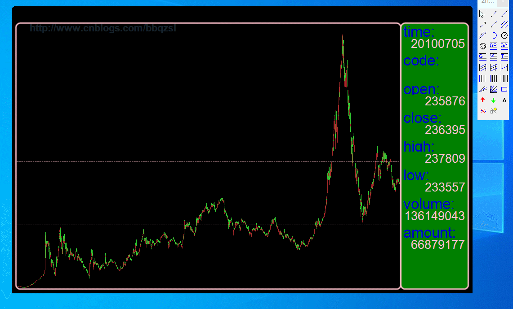
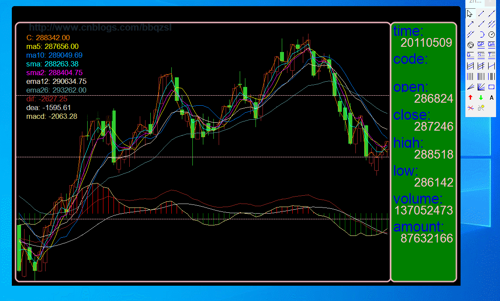
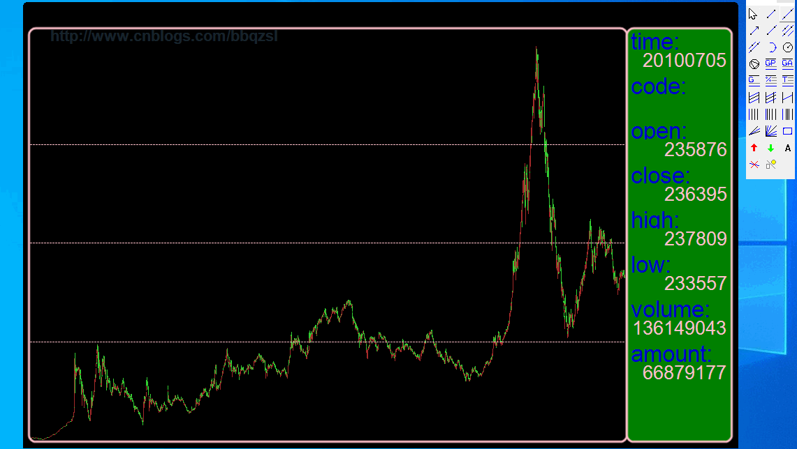

# KTL

a **Candle**stick **T**echnical analysis tool **L**ite for stock market. ability to use **c++14** even with **simd** and **omp** to edit your technical indicators on this app lite.

K线技术分析工具，在这个平台上你能够使用c++14编写K线技术指标等。

----------------------------

### doc
[doc](https://github.com/bbqz007/KTL/doc/readme.md)

----------------------------

### release
[latest release](https://github.com/bbqz007/KTL/blob/master/bin/KTL%20%5Bzhelper.release.20211209%5D.7z)

----------------------------

### patch
[resource2-2.pkg](https://github.com/bbqz007/KTL/blob/master/patch/resource2-2.pkg)

### load

### edit

### recovery

### logo

