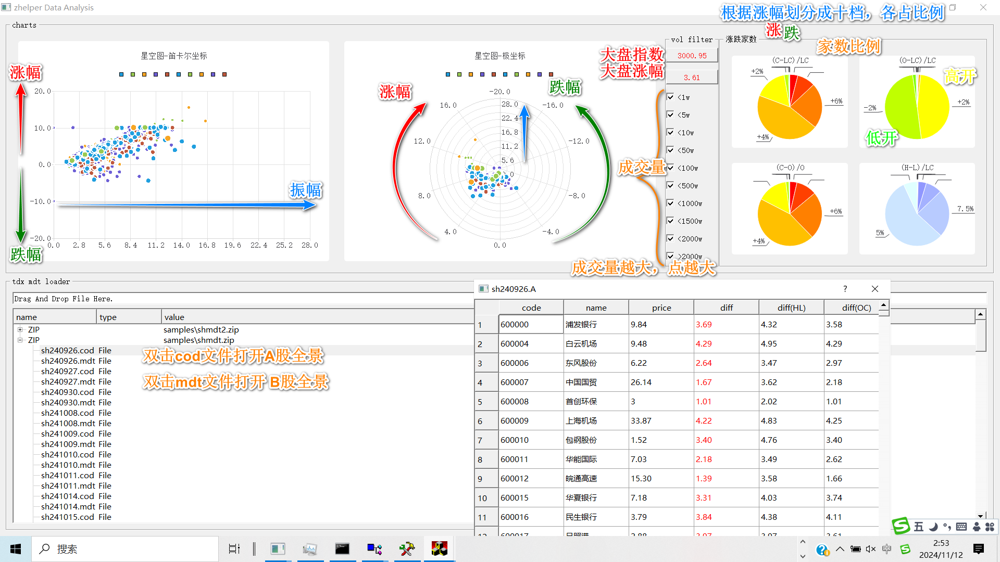
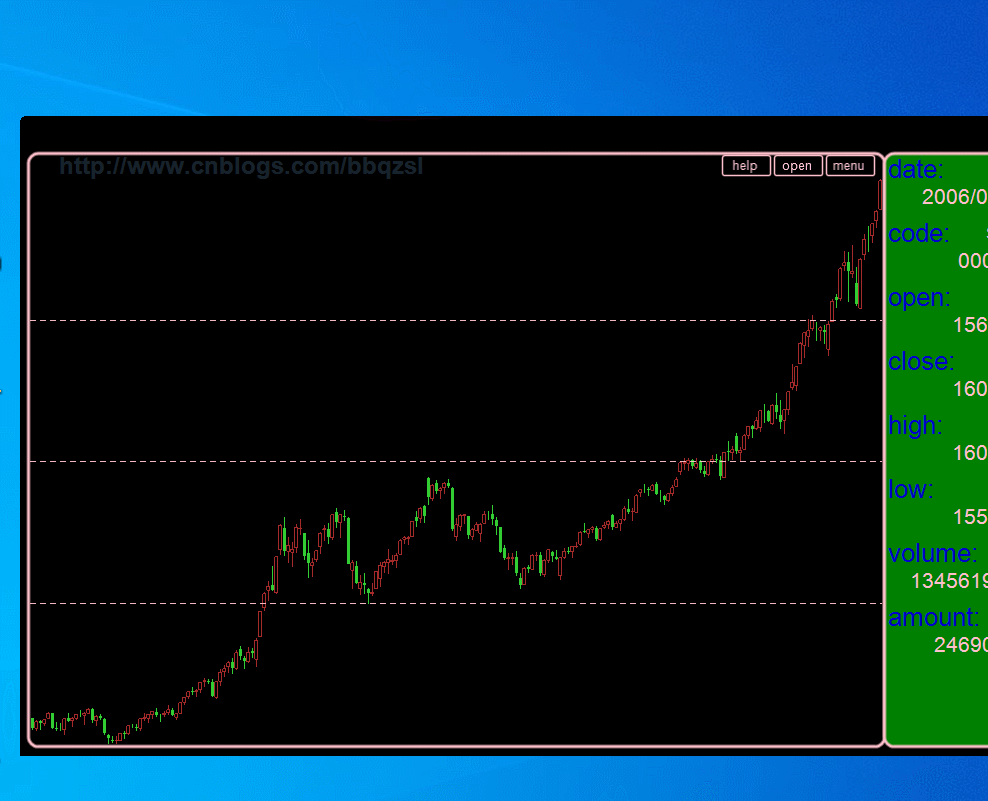
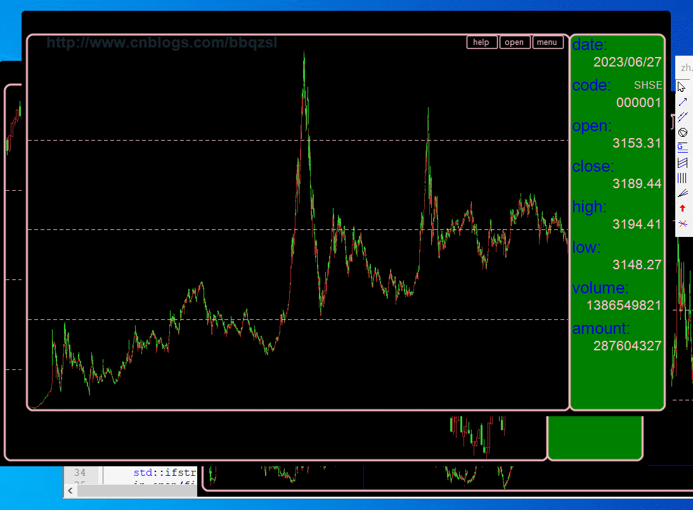

# KTL

a **Candle**stick **T**echnical analysis tool **L**ite for stock market. ability to use **c++14** even with **simd** and **omp** to edit your technical indicators on this app lite. Advanced programming of **Qt**, **OpenGL**, **GPGPU** and **sqlite3**.

K线技术分析工具，在这个平台上你能够使用**c++14**编写K线技术指标等。

### What's New
you can use **OPENGL** to write 3D graphs or **GPGPU** programs.

you can use **sqlite3** c apis or my helper [zqlite3](https://github.com/bbqz007/sqlite3zz) stream style syntax.

you can write **Qt** widgets on your custom window using simple syntax powered by [zqt5](https://github.com/bbqz007/zqt5).

你能够通过[zqt5](https://github.com/bbqz007/zqt5)简单的语法，编写属于你自己的**Qt**窗口。

Using SIMD instructions to rewrite built-in formulas for performance optimization.

内置公式使用SIMD重写优化性能。

### repo
home: [github.com/bbqz007/KTL](https://github.com/bbqz007/KTL)

mirror: [CN, gitee.com/bbqz007/KTL](https://gitee.com/bbqz007/KTL)

[blog page](https://www.cnblogs.com/bbqzsl/p/15195253.html)

----------------------------

### release
[latest release](https://github.com/bbqz007/KTL/releases)

----------------------------

### patch
Advanced programming depends to these packages.
* [resource2-2.pkg](patch/resource2-2.pkg)
* [resource2-3.pkg](patch/resource2-3.pkg)

----------------------------

### doc
[doc](doc)

----------------------------
### charts

----------------------------
### GPGPU

### Qt+OpenGL

### QtTool

### Sqlite3 Stream

### compile and load

### editor

### recovery

### logo

